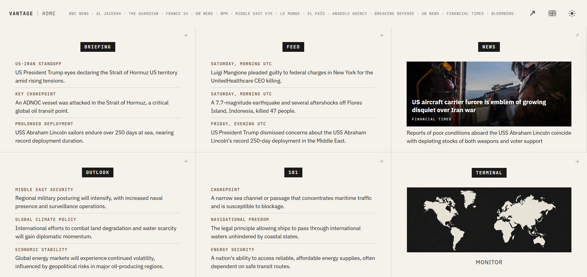
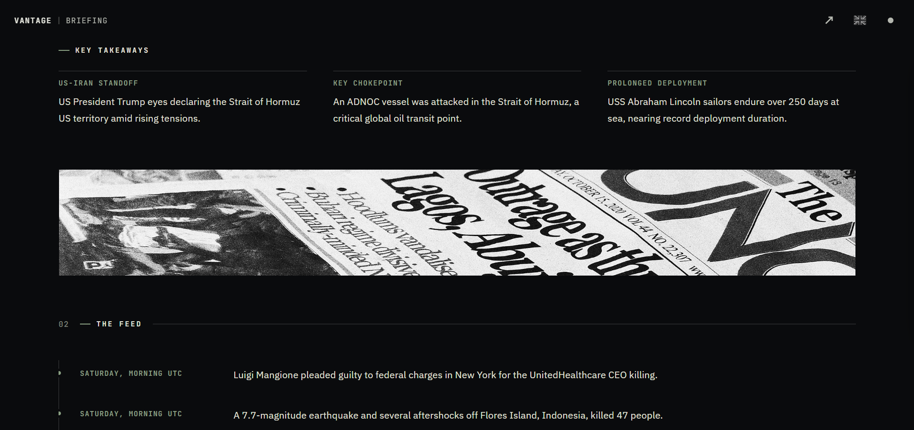
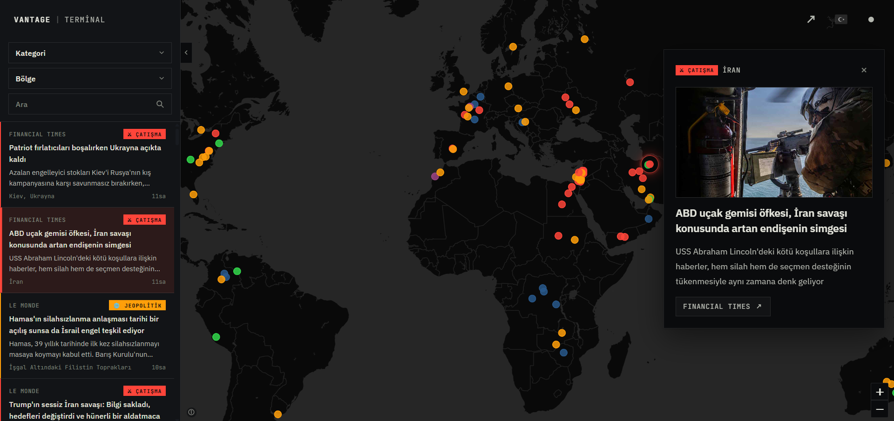
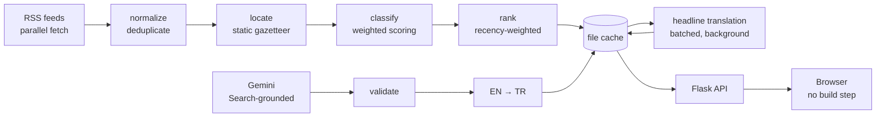

# Vantage

**Daily geopolitical briefings with a live map based view of global events.**

**[vantage.talhaid.tech](https://vantage.talhaid.tech)**

---

## What it is

What it is

---

## What it is

Following world events usually means one of two things: scrolling a feed that is fast but shapeless, or reading a long analysis that arrives days later. Vantage sits between the two. Twice a day it produces a short editorial briefing on where the geopolitical picture stands, and it keeps a live map of the wires underneath it, so the summary and the raw material are one click apart.

The briefing is formatted with dedicated sections that present the geopolitical picture compactly and quickly, while also thoroughly from different angles — taking the mechanism behind each event from first principles — and its highlights surface on the home page, so a quick look can get you on top of the global situation as quickly as possible.

The live map, meanwhile, shows raw developments with their locations and categories, giving a general sense of the geopolitical picture while letting you browse and follow the stories themselves.

- **Briefing** — a twice-daily editorial view of the agenda, in English and Turkish
- **Terminal** — a live map of geopolitical news, article by article
- **Pipeline** — automated ingestion, classification and location behind both

## Status

Vantage 1.0 is live.

This is the first public version. It went out once it stood on its own, rather than waiting
on a more complete one, and the platform carries on developing in public. Changes are
documented in the [changelog](CHANGELOG.md) as they ship.

## Home

The opening screen is a grid of cards drawn from the current briefing: the day's key
points, the latest developments, the outlook, the concept behind the main story, and one
wire story chosen by hand as the day's lead. A glance is meant to be enough to know where
things stand; each card opens the briefing at the section it came from.

## Briefing

The full text, in English and Turkish, in four parts.

| Section | What it holds |
|---|---|
| **Summary** | The day's core story in three paragraphs, closing with three takeaways |
| **The Feed** | The most significant developments of the last 24 hours, newest first |
| **101** | The mechanism behind the main story, explained from first principles, with the stated framing set against the underlying interest |
| **Outlook** | Three forward-looking vectors — what is expected to move, what is driving it, and a concrete trigger to watch |

A new edition is written on a schedule — around twice a day — and never in response to a
reader arriving. The schedule is a baseline rather than a rule: the agenda does not move at
a fixed rate, so a day that turns over faster can take another edition, and between editions
the text can be corrected in place.

## Terminal

The wires themselves. Every article that names a place is drawn at its coordinates next to
a filterable list — the same filtered set, rendered twice. Filters work on category,
region, free text and time, so a region can be read on its own, and a story on the map
opens the article beside it.

---

## How it works

Ingestion, editorial generation and serving are separate: a reader's visit never triggers
model work, and every expensive stage writes to the cache the request path reads from.
Location is resolved before classification because where a story happens is one of the
signals used to decide what it is about.

### Ingestion

Sources are read directly from each publisher rather than through an intermediary — global
broadcasters and dailies, defence and security reporting, institutional and financial
feeds. Fetches run
in parallel with a per-feed timeout, so a slow or broken publisher costs only its own
articles. The cycle repeats every fifteen minutes; anything older than 48 hours is dropped
at ingest, and near-identical headlines from different outlets are collapsed into one entry.
The list is ordered with a recency weighting, so a fresh item surfaces without pushing the
day's larger stories out of view.

The mix is deliberately weighted towards general international coverage, alongside defence
and security reporting and institutional and financial feeds. Narrowing a subject is the
briefing's job, not the feed's — verticals outside those lines were removed rather than
filtered, and the list grows as coverage gaps show up.

### Classification

Categories are assigned by a rule-based scoring pass rather than a model call. Each
category accumulates evidence from a weighted vocabulary — unambiguous phrases count for
more than single words that carry several meanings, and a headline counts for more than a
description. Ambiguous terms can be vetoed by context, so *strikes* in an earthquake
headline is not read as conflict. Signals outside the text — the publisher's own tag, the
URL, the resolved location — contribute, but their combined weight is capped below the
threshold needed to decide: metadata can tilt a decision, never make one. Anything that
fails to clear the threshold lands in a residual bucket instead of being forced into a
category, and the vocabulary is measured against a hand-labelled set when it changes.

One additional check applies to the humanitarian axis, where reporting formats — photo
galleries, single-rescue narratives, human-interest follow-ups — outnumber the events
themselves. An item stays only if it shows evidence of scale.

### Location

Places are resolved from the headline and summary against a static gazetteer of roughly
1,500 entries, matched longest-first so a city wins over the country containing it. There
is no geocoding service in the path: resolution is instant, free and deterministic, which
also means coverage is uneven and an article that names no place is simply not drawn.

### The briefing

The briefing is generated with Google Search grounding, and no article text is placed in
the prompt. This is deliberate: a model asked to write "today's briefing" from memory
produces fluent, well-formed text describing events that did not happen, and a summary of
our own feeds could never see further than those feeds — which is the point of having a
briefing at all.

This is what the current version settled on, and it was chosen against a working
alternative. An earlier design took the more familiar route: a wider set of publishers,
full-text extraction on the top-ranked articles, and a two-stage pipeline that pulled
structured events out of that material before an editorial pass wrote them up. Read side by
side, grounded research produced the stronger briefing — wider in what it could reach,
faster to produce, and cleaner to reason about. That comparison is why it ships this way.

A layered approach still has a place ahead: structured extraction feeding a grounded
editorial pass, so research supplies reach and structure supplies depth. That belongs to a
later version, not to this one — see [Status](#status).

The prompt is closer to a specification than a request. It fixes the four sections, sets a
word budget for each, and defines the anchors the frontend parses; several passages are
rendered verbatim on the home cards, so their length limits are part of the contract.
Output is checked before it is stored — refusals, disclaimer language, fabrication markers
and a missing section anchor all fail the check, and a failed generation is retried rather
than published.

English is the single source of truth. The Turkish edition is a translation of the finished
English text, so the two cannot disagree on a fact. Structural anchors are replaced with
opaque tokens before translation, so the model only ever sees prose, and the result is
verified slot by slot — a title that comes back identical to the English counts as a failed
translation, not a finished one.

Terminal headlines are translated separately, in batches on a background thread, and read
from cache on the request path.

Generation is automatic, but the output is not left unattended. A briefing that reads
poorly can be rewritten or regenerated, a story can be pinned to the top or withheld, and
the day's lead is chosen rather than computed. A subject that moves this quickly rewards a
system that can be steered without waiting for the next cycle.

### Serving

Flask serves cached JSON; ingestion, generation and translation all run on background
threads. A stale cache is served immediately and refreshed behind the reader, concurrent
triggers collapse into a single run, and a failed generation goes into a cooldown before
anything can trigger another. No reader action calls the model, so the daily cost of the
system is a function of time rather than traffic.

Editorial changes take effect without a deploy. They are held apart from the cache and
merged as each response is built, so an edit survives the next refresh cycle instead of
being overwritten by it — the same reason derived fields are resolved when a response is
served rather than frozen when it is written.

Typical figures from the run journal on the live instance:

| | |
|---|---|
| Ingest cycle | ~2 s across the full feed set, repeated every 15 minutes |
| Articles held after each cycle | ~250, once deduplication and the 48-hour cut are applied |
| Briefing generation | ~50–65 s end to end: grounded English, then the Turkish translation |
| Model calls caused by a page view | none — generation is scheduled, translation is batched under a fixed daily ceiling |

### Interface

The frontend is vanilla JavaScript with no build step and no runtime dependencies loaded
from third parties — the map and markdown libraries are vendored and served from the same
origin, behind a strict content security policy, with generated markdown passed through an
allowlist before it reaches the page. The whole interface is bilingual, down to place names
and the briefing's own timestamps, and follows a light and dark theme. On a phone the
terminal becomes a bottom sheet with drag detents, the list renders a window at a time, and
images load through a bounded queue.

---

## Stack

| Layer | |
|---|---|
| Backend | Python 3.11, Flask |
| Data | pandas, numpy |
| Ingestion | feedparser, requests, thread pool |
| Model | Google Gemini 2.5 Flash, Search grounding |
| Frontend | Vanilla JS, Leaflet, marked — vendored, no build |
| Storage | Files on a persistent volume |
| Serving | gunicorn |

## About this repository

This is the public record for Vantage — description, screenshots and
[changelog](CHANGELOG.md), growing with the platform. The platform itself is not an
open-source project, and its source lives in a private repository.

**[Talha İsmail Dilek](https://talhaid.tech)** · [vantage.talhaid.tech](https://vantage.talhaid.tech)
